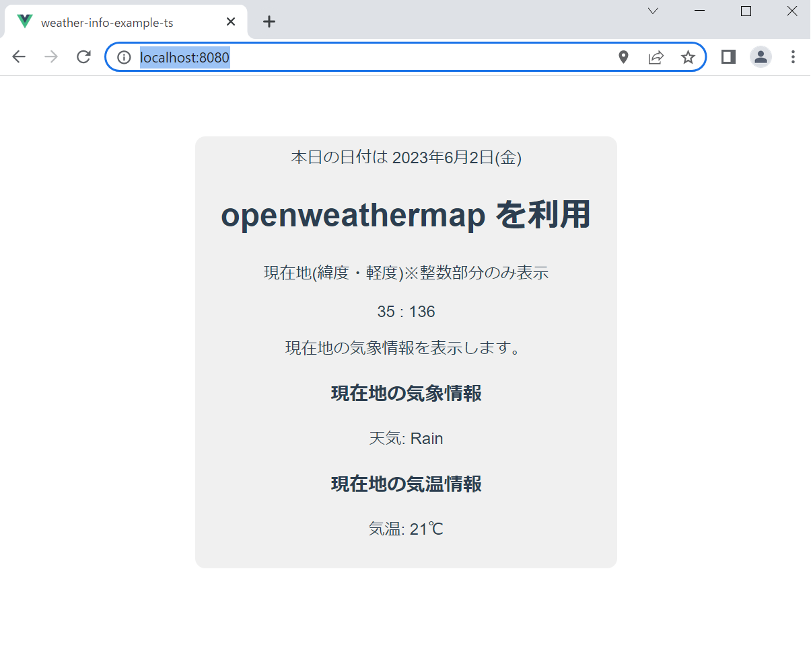
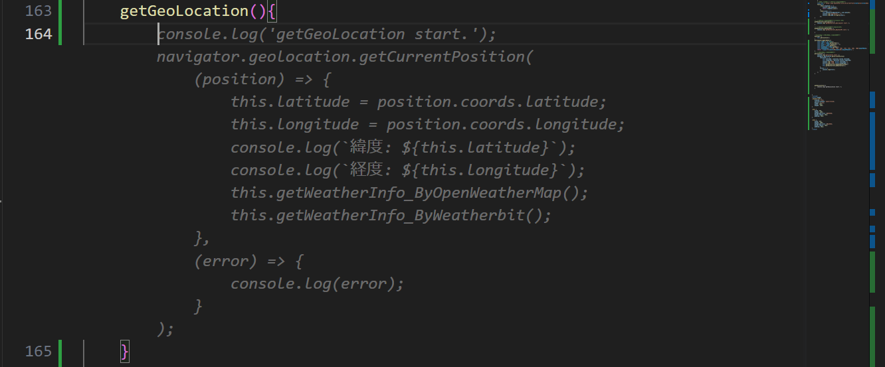
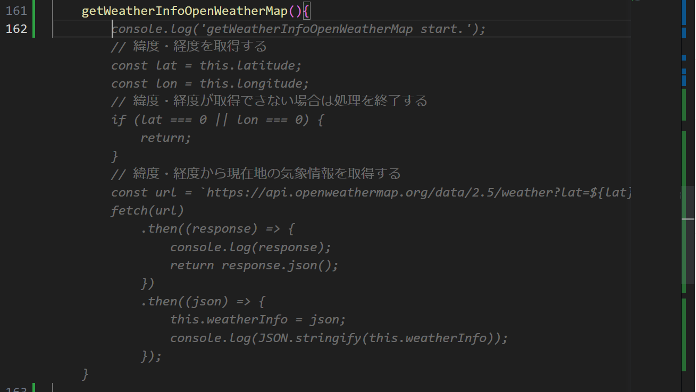
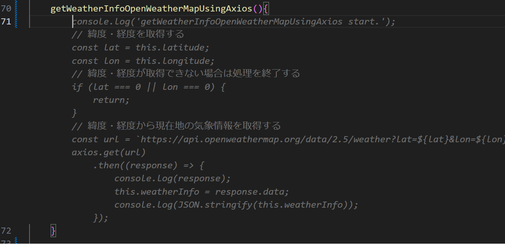
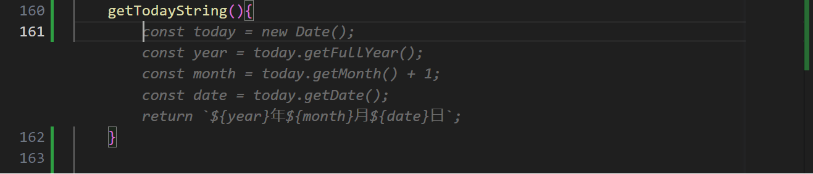
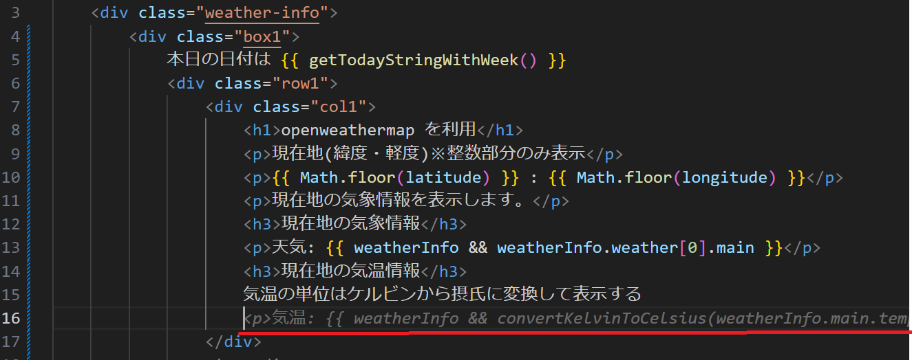

# Github Copilot

# はじめに
こんにちは。ACS 事業部の奥山です。

Github Copilot を利用して簡単なサンプルアプリを作成してみましたのでブログにしておきます。

## サンプルアプリについて 
現在地（緯度・軽度）の情報をもとに天気の情報を取得するAPIの動作確認用の簡単なアプリです。
※SPA(Vue2 + Typescript)で作成しています。

### 画面イメージ

画面表示時に天気APIをコールして取得できた天気情報を表示するだけのアプリになります。

## Github Copilotを使って作る

### 1.  緯度・経度を取得
天気APIで良くあるパラメーター緯度・経度を取得する処理  
関数名を getGeoLocation とだけを書いただけですが、navigator.geolocation.getCurrentPosition を利用して、緯度・経度を取得するプログラムが提案されています。エラーハンドリング部分も実装されていますね。

### 2. api.openweathermap.org の APIを呼び出す処理
関数名を getWeatherInfoOpenWeatherMap としてみました。こちらは fetch api を使った処理が提案されました。url の部分（https://api.openweathermap.org/data/2.5/weather?lat=）まで提案されているのがすごいですね。
受け取ったデータから json形式 で値を取り出すところまで一通り実装されています。

axiosを使った処理に変更したいなと思ったので関数名を getWeatherInfoOpenWeatherMapUsingAxios としてみました。axiosを使った処理が提案されました。いい感じですね。

### 3. 本日の日付を表示するために 文字列(yyyy年mm月nn日)
関数名をgetTodayString()としてみました。こちらは日付を取得する処理が提案されました。

曜日も表示したいな。ということで関数名に WithWeek とつけてみます。

いい感じで曜日が追加されました。すごいです。汎用的な処理はもう Copilot に書かせてしまえば良い感じですかね。

### 4. 気温の単位を変換する
HTML Templateでも提案してくれます。

提案された関数 convertKelvinToCelsius を追加します。

今回はあまり時間がないので簡単にここまでにしておきます。簡単なアプリですが、ほとんど Github Copilot が作ってくれた感じですね。
Github Copilot まだまだ使いこなせていませんが、今後も使っていきたいと思います。

# 最後に
私達ACS事業部はAzure・AKSを活用した内製化のご支援をしております。ご相談等ありましたらぜひご連絡ください。

[https://www.ap-com.co.jp/cloudnative/?utm_source=blog&utm_medium=article_bottom&utm_campaign=cloudnative:embed:cite]

また、一緒に働いていただける仲間も募集中です！   
切磋琢磨しながらスキルを向上できる、エンジニアには良い環境だと思います。ご興味を持っていただけたら嬉しく思います。

[https://www.ap-com.co.jp/recruit/info/requirements.html?utm_source=blog&utm_medium=article_bottom&utm_campaign=recruit:embed:cite]

<fieldset style="border:4px solid #95ccff; padding:10px">
本記事の投稿者: [奥山 拓弥](https://techblog.ap-com.co.jp/archive/author/mountain1415)  
</fieldset>
