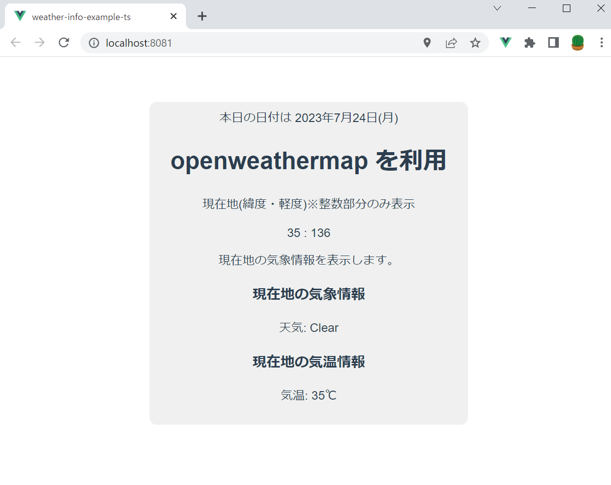

# Github Copilot Lab

# はじめに
こんにちは。ACS 事業部の奥山です。

前回の続きで Github Copilot ネタです。
GitHub Copilot Lab という拡張機能を VSCode で動かしてみましたのでブログにしておきます。

## GitHub Copilot Lab とは
[公式サイトはこちら](https://githubnext.com/projects/copilot-labs/)  
GitHub Copilot Labでは主に以下が可能です。  
・code explanation (コードの説明)  
・code translation (コードの変換)  
・IDE Brushes ★今回はこちらをメインに試しています。  
・test generation (テスト生成)  


## 検証用のサンプルアプリについて


前回作成した天気情報を表示する単純なアプリになります。
今回は主にaxiosを利用して天気情報を取得する以下の処理に対して、GitHub Copilot Labを利用してコードの改善を行ってみます。

```typescript
    getWeatherInfoOpenWeatherMapUsingAxios() {

        const lat = this.latitude;
        const lon = this.longitude;

        if (lat === 0 || lon === 0) {
            return;
        }

        const url = this.openweathermap_url + `?lat=${lat}&lon=${lon}&appid=${process.env.VUE_APP_OPEN_WEATHER_MAP_API_KEY}`;
        axios.get(url)
            .then((response) => {
                this.weatherInfo = response.data;
            });
    }
```
## GitHub Copilot Lab (IDE Brushes)


いくつかの機能について簡単に試してみます。手順としては対象の関数を選択した状態でそれぞれの機能を実行するだけです。

### READABLE
読みやすく(?)します。
ローカル変数名が自動で変わりました。latがlatitudeに、lonがlongitudeに変わりました。
```typescript
        const lat = this.latitude;
        const lon = this.longitude;
```        
```typescript
        const latitude = this.latitude;
        const longitude = this.longitude;        
```
これはそれほど便利とう感じはしませんね。もっと複雑なコードを書いた場合には便利かもしれません。

### ADD TYPES
```typescript
        axios.get(url)
            .then((response) => {
                this.weatherInfo = response.data;
            });
```
この処理に対して「ADD TYPES」を実行してみます。
```typescript
        axios.get(url)
            .then((response: AxiosResponse<WeatherResponse>) => {
                this.weatherInfo = response.data;
            });
```
レスポンスの型を追加してくれましたが、ちょっと期待と違うので自分で以下の用にすこし変更して再度実行。※asyn/awaitを利用するように変更。
```typescript
    async getWeatherInfoOpenWeatherMapUsingAxios() {
        ：
            const response = await axios.get(url);
        ：
```
getの後に型`<ResponseType>`を追加してくれました。※ResponseType は未定義の型なので、自分で定義する必要があります。
```typescript
            const response = await axios.get<ResponseType>(url);
```
[openweathermap](https://openweathermap.org/current) にサンプルのレスポンスJSONがあるので、これを元に作成していきますが、Copilotがほぼすべてをサジェストしてくれるので非常に助かります。TabとEnterを押すだけで定義ができあがりました。  ※これはCopilot Labsの機能ではないです。


型が効いていることが確認できます。weather[0].mainに数値は代入でいないようになりました。


### FIX BUG
単純なバグであれば自動で修正してくれます。※少しミスのあるコードに書き換えて実行しています。
```typescript
    getTodayStringWithWeek() {
        const today = new Date();
        const year = today.getFullYear();
        const month = today.getMonth();
        const date = today.getDate();
        const dayOfWeek = today.getDay();
        const dayOfWeekStr = ["日", "火", "月", "水", "木", "金", "土"][dayOfWeek];
        return `${year}年${month}月${date}日(${dayOfWeekStr})`;
    }
```
実行後は月を1オリジンにして、曜日の並びが修正されています。
```typescript
    getTodayStringWithWeek() {
        const today = new Date();
        const year = today.getFullYear();
        const month = today.getMonth() + 1;
        const date = today.getDate();
        const dayOfWeek = today.getDay();
        const dayOfWeekStr = ["日", "月", "火", "水", "木", "金", "土"][dayOfWeek];
        return `${year}年${month}月${date}日(${dayOfWeekStr})`;
    }
```

### DEBUG と CLEAN
デバッグ用のコード(console.log)を追加・削除してくれます。
```typescript
    async getWeatherInfoOpenWeatherMapUsingAxios() {
        const latitude = this.latitude;
        const longitude = this.longitude;

        if (latitude === 0 || longitude === 0) {
            console.log('Latitude or Longitude is 0');
            return;
        }

        try {
            const url = this.openweathermap_url + `?lat=${latitude}&lon=${longitude}&appid=${process.env.VUE_APP_OPEN_WEATHER_MAP_API_KEY}`;
            const response = await axios.get<WeatherResponse>(url);
            if (response.status !== 200) {
                console.log('Response status is not 200');
                return;
            }
            this.weatherInfo = response.data;
        }
        catch (error) {
            console.log('Error: ' + error);
        }
    }
```
既存のソースの動作確認時などにはこれは意外に便利かもしれません。
※CLEANで追加したDEBUGログを削除できます。

### MAKE ROBUST
コードをより堅牢にしてくれます。
```typescript
    async getWeatherInfoOpenWeatherMapUsingAxios() {
        const latitude = this.latitude;
        const longitude = this.longitude;

        if (latitude === 0 || longitude === 0) {
            console.log('Latitude or Longitude is 0');
            return;
        }

        try {
            const url = this.openweathermap_url + `?lat=${latitude}&lon=${longitude}&appid=${process.env.VUE_APP_OPEN_WEATHER_MAP_API_KEY}`;
            const response = await axios.get<WeatherResponse>(url);
            if (response.status !== 200) {
                console.log('Response status is not 200');
                return;
            }

            // Check if data is available
            if (response.data) {
                this.weatherInfo = response.data;
            }
            else {
                console.log('Response data is not available');
            }
        }
        catch (error) {
            console.log('Error: ' + error);
        }
    }
```
エラー処理が増えました。具体的にはデータが有効かどうかの判定 `if (response.data)` が追加されました。
こちらもエラー処理の参考にできるのではないでしょうか？

### LIST STEPS
各処理毎にコメントを追加してくれます。
```typescript
    async getWeatherInfoOpenWeatherMapUsingAxios() {
        // Get latitude and longitude from the browser
        const latitude = this.latitude;
        const longitude = this.longitude;

        // Check if latitude or longitude is 0
        if (latitude === 0 || longitude === 0) {
            console.log('Latitude or Longitude is 0');
            return;
        }

        try {
            // Construct the url
            const url = this.openweathermap_url +
                `?lat=${latitude}&lon=${longitude}&appid=${process.env.VUE_APP_OPEN_WEATHER_MAP_API_KEY}`;

            // Get the weather data from the weather API
            const response = await axios.get<WeatherResponse>(url);

            // Check if the response status is not 200
            if (response.status !== 200) {
                console.log('Response status is not 200');
                return;
            }

            // Check if data is available
            if (response.data) {
                this.weatherInfo = response.data;
            }
            else {
                console.log('Response data is not available');
            }
        }
        // Catch errors
        catch (error) {
            console.log('Error: ' + error);
        }
    }
```
うーん、これはそこまで便利でもないかな。。

# まとめ
今回は Github Copilot Lab の簡単な紹介ブログとなりました。 まだまだ知らない機能があるので継続的に調査・検証していきたいと思います。

# 最後に
私達ACS事業部はAzure・AKSを活用した内製化のご支援をしております。ご相談等ありましたらぜひご連絡ください。

[https://www.ap-com.co.jp/cloudnative/?utm_source=blog&utm_medium=article_bottom&utm_campaign=cloudnative:embed:cite]

また、一緒に働いていただける仲間も募集中です！   
切磋琢磨しながらスキルを向上できる、エンジニアには良い環境だと思います。ご興味を持っていただけたら嬉しく思います。

[https://www.ap-com.co.jp/recruit/info/requirements.html?utm_source=blog&utm_medium=article_bottom&utm_campaign=recruit:embed:cite]

<fieldset style="border:4px solid #95ccff; padding:10px">
本記事の投稿者: [奥山 拓弥](https://techblog.ap-com.co.jp/archive/author/mountain1415)  
</fieldset>
