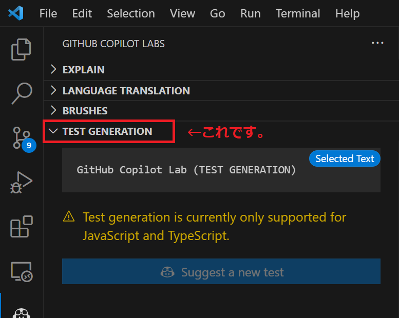
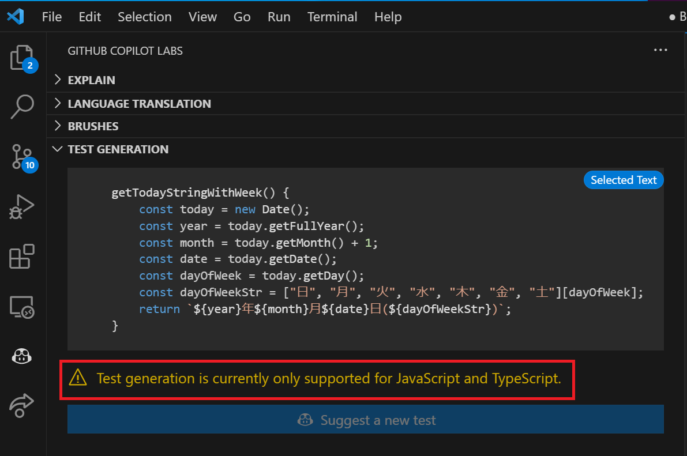
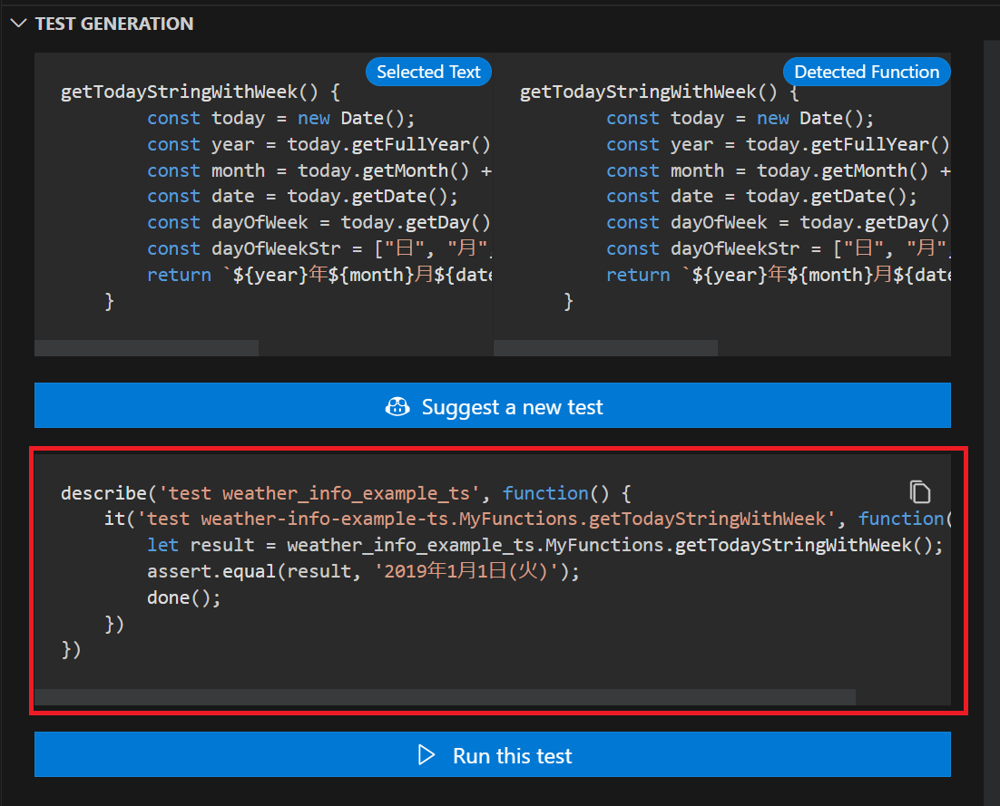
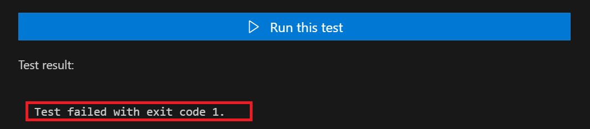

# Github Copilot Lab

# はじめに

こんにちは。ACS 事業部の奥山です。

前回の続きで Github Copilot Lab ネタです。
GitHub Copilot Lab という拡張機能を VSCode で動かしてみましたのでブログにしておきます。

## GitHub Copilot Lab とは

[公式サイトはこちら](https://githubnext.com/projects/copilot-labs/)  
GitHub Copilot Lab では主に以下が可能です。  
・code explanation (コードの説明)  
・code translation (コードの変換)  
・IDE Brushes (コードの改善いろいろ)  
・test generation (テスト生成)★ 今回はこちらをメインに試しています。

## 検証用のサンプルアプリについて

Vue 2 + Typescript で作成された簡単なアプリです。


前回作成した天気情報を表示する単純なアプリになります。
今回は TEST GENERATION を 利用してみます。

## GitHub Copilot Lab (TEST GENERATION)



### さっそく使ってみます

本日の日付を取得する簡単な関数があるのでそれで試してみます。きっと簡単に利用できるはず。
この関数を選択して TEST GENERATION を実行します。

```typescript
<script lang="ts">
import { Component, Vue } from 'vue-property-decorator';
import axios from 'axios';
import { WeatherResponse } from '@/types/response';

@Component
export default class WeatherInfo extends Vue {
    :
    : (省略)
    :
    getTodayStringWithWeek() {
        const today = new Date();
        const year = today.getFullYear();
        const month = today.getMonth() + 1;
        const date = today.getDate();
        const dayOfWeek = today.getDay();
        const dayOfWeekStr = ["日", "月", "火", "水", "木", "金", "土"][dayOfWeek];
        return `${year}年${month}月${date}日(${dayOfWeekStr})`;
    }
    :
    : (省略)
    :
}
```

あれ。。。

「Test generation is currently only supported for JavaScript and Typescript」 となってます。Typescript なのに。。。おかしいな Typescript なんだけどな。

vue のコンポーネントの中に書いてあるからかな？と思い、vue の外に関数を書いてみます。

ファイル名:my_function.ts として以下のように関数を作成します。

```typescript
class MyFunctions {
  // コンストラクタ
  constructor() {
    // 初期化などの処理を行う場合はここに記述
  }

  getTodayStringWithWeek() {
    const today = new Date();
    const year = today.getFullYear();
    const month = today.getMonth() + 1;
    const date = today.getDate();
    const dayOfWeek = today.getDay();
    const dayOfWeekStr = ["日", "月", "火", "水", "木", "金", "土"][dayOfWeek];
    return `${year}年${month}月${date}日(${dayOfWeekStr})`;
  }

  getDouble(num: number) {
    return num * 2;
  }
}
```

お、出てきた！

※なぜか 2019 年 1 月 1 日 となっていますが。。。
※実行には chai, mocha のインストールが必要でした。

```
npm install --save-dev chai mocha
```

実行してみますが、エラー。。。


コンソールを確認すると以下のようなエラーが出ています。

```log
apc-user:weather-info-example-ts $ node /home/apc-user/study-copilot/weather-info-example-ts/testpilot-GLGs1i/testPilotMochaRunner.js /home/apc-user/study-copilot/weather-info-example-ts/node_modules/mocha/bin/mocha.js /home/apc-user/study-copilot/weather-info-example-ts/testpilot-GLGs1i/test.js

Error: Cannot find module '..'
Require stack:
- /home/apc-user/study-copilot/weather-info-example-ts/testpilot-GLGs1i/test.js
```

「Error: Cannot find module '..'」？？あれれ。。。

# まとめ

今回も Github Copilot Lab の簡単な紹介ブログとなりました。

# 最後に

私達 ACS 事業部は Azure・AKS を活用した内製化のご支援をしております。ご相談等ありましたらぜひご連絡ください。

[https://www.ap-com.co.jp/cloudnative/?utm_source=blog&utm_medium=article_bottom&utm_campaign=cloudnative:embed:cite]

また、一緒に働いていただける仲間も募集中です！  
切磋琢磨しながらスキルを向上できる、エンジニアには良い環境だと思います。ご興味を持っていただけたら嬉しく思います。

[https://www.ap-com.co.jp/recruit/info/requirements.html?utm_source=blog&utm_medium=article_bottom&utm_campaign=recruit:embed:cite]

<fieldset style="border:4px solid #95ccff; padding:10px">
本記事の投稿者: [奥山 拓弥](https://techblog.ap-com.co.jp/archive/author/mountain1415)  
</fieldset>
